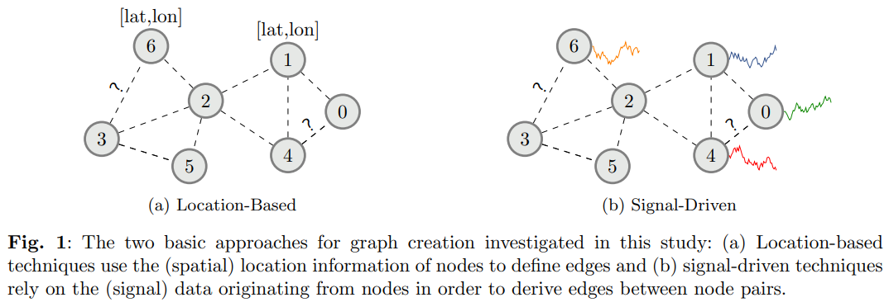

## Graph Construction on Complex Spatio-Temporal Data for Enhancing Graph Neural Network-Based Approaches

#### Authors: Stefan Bloemheuvel, Jurgen van den Hoogen and Martin Atzmueller

## Streamlit Demo Page

[Link to Streamlit demo page](https://stefanbloemheuvel-graph-comparison-streamlit-app-dplan6.streamlit.app/)

## Data
data can be found at = https://zenodo.org/record/7900964

The data can be found at the following "[Link]([https://arxiv.org/pdf/2201.06367.pdf](https://zenodo.org/record/7900964)". 

This is the source code of WWW-2022 paper "[Graph Construction on Complex Spatio-Temporal Data for Enhancing Graph Neural Network-Based Approaches]([https://arxiv.org/pdf/2201.06367.pdf](https://zenodo.org/record/7900964)" (SUBLIME).

## Requirements
* tensorflow
* tsl
* numpy
* pandas
* cuda
* networkx
  
## Usage
the inputs_la, input_bay, inputs_ci and inputs_cw files should be put in the sensor locations folder.
in a 'data' folder the whole data.zip file should be placed.
run either the earthquake.py file or traffic.py file for the results.
models for the forecasting traffic analysis can be found in all_models.py

